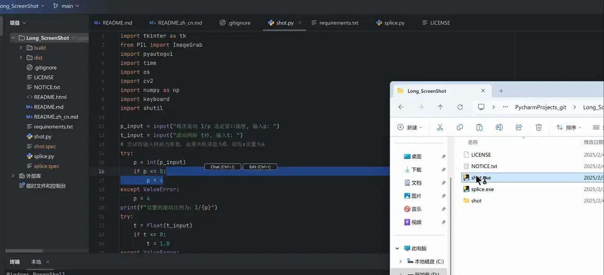

# Long_ScreenShot

[切换到中文](./README.zh_cn.md)

Long_ScreenShot is a long screenshot tool based on Euclidean distance calculation. It automatically scrolls the screen and captures multiple short screenshots, then stitches them together by comparing grayscale images and minimizing the Euclidean distance to determine the optimal stitching position.

## Features

- **Auto-scrolling Screenshot**: Automatically scrolls the screen and captures multiple short screenshots.
- **Smart Stitching**: Compares grayscale images of consecutive short screenshots and uses a Euclidean distance minimization algorithm to determine the stitching position for seamless results.
- **Customizable Parameters**: Supports customizable parameters to adapt to different screenshot needs.
- **Watermark Insensitivity**: The program is insensitive to light watermarks, making it suitable for various scenarios.
- **Optimized for Text-heavy Scenes**: Performs well in text-dense environments.

## Usage

### 1. Run `shot.py`

1. Run the `shot.py` script.
2. Select the screen area, and the program will automatically scroll and capture multiple short screenshots, saving them to a temporary folder.

### 2. Run `splice.py`

1. Run the `splice.py` script.

2. The program will compare the grayscale images of consecutive short screenshots by sliding them vertically, minimizing the Euclidean distance of the overlapping area to determine the stitching position and stitch them together.

   

### Parameter Configuration

- When running `shot.py` and `splice.py`, you can set parameters. If no parameters are provided, the program will run with default values.
- If the screenshot or stitching results are not satisfactory, adjust the parameters for better performance.

## Notes

- **Screenshot Area**: Avoid having static elements in the scrolling screenshot area to ensure optimal stitching results.
- **Light Watermarks**: The program is insensitive to light watermarks, but it is still recommended to avoid large watermarks during screenshots.
- 🤖**During the process of scrolling for screenshots, please keep the mouse pointer on the window that needs to be scrolled.**
- 🤖**The program automatically stops scrolling and screenshotting when it detects the bottom of the page. Press the Esc key to stop the scrolling screenshot manually.**

## Test Results

Long_ScreenShot has been tested to perform well in text-dense scenarios, effectively handling complex screenshot requirements.

## **Dependencies and Licenses**

This project uses the following third-party Python libraries:

| Dependency     | License                      |
| -------------- | ---------------------------- |
| OpenCV (`cv2`) | Apache 2.0                   |
| NumPy          | BSD 3-Clause                 |
| Numba          | BSD 2-Clause                 |
| Pillow (`PIL`) | PIL License (MIT Compatible) |
| PyAutoGUI      | BSD 3-Clause                 |
| Keyboard       | MIT                          |
| Tkinter        | Python Standard Library      |
| Shutil         | Python Standard Library      |

All third-party libraries used in this project are compatible with the MIT license. For more details, please refer to the official documentation or license files of each library.